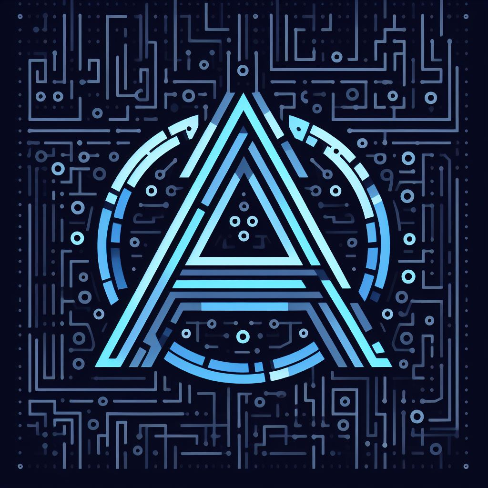

<a name="readme-top"></a>


<!-- PROJECT SHIELDS -->
</img>
[![Contributors][contributors-shield]][contributors-url]
[![Forks][forks-shield]][forks-url]
[![Stargazers][stars-shield]][stars-url]
[![Issues][issues-shield]][issues-url]
[![MIT License][license-shield]][license-url]


<!-- PROJECT LOGO -->
<br />
<div align="center">

  <a href="https://github.com/ahmed-alllam/AlphaLogos">
    
  </a>

<h3 align="center">AlphaLogos: Logic Synthesis Optimization</h3>

  <p align="center">
    <a href="http://alpha-logos-1464863388.eu-west-3.elb.amazonaws.com/">View Demo</a>
    ·
    <a href="https://github.com/ahmed-alllam/AlphaLogos/issues">Report Bug</a>
    ·
    <a href="https://github.com/ahmed-alllam/AlphaLogos/issues">Request Feature</a>
  </p>
</div>


<!-- ABOUT THE PROJECT -->


## About The Project

AlphaLogos is a logic synthesis optimization tool that takes a logic circuit and optimizes it using the Quinn-McCluskey algorithm. It is designed with the intention to aid individuals in understanding and visualizing the process of logic minimization, which is crucial in digital design. The application leverages the power of the Quine-McCluskey algorithm to simplify logical expressions, rendering a more comprehensible and optimized version of the input logic circuit. The core functionalities include generating truth tables, obtaining minimized Boolean expressions, and visualizing the corresponding Karnaugh Maps and logic circuits. You can access the project demo using this [link](http://alpha-logos-1464863388.eu-west-3.elb.amazonaws.com/).

You can delve deeper into the developmental journey and the technical aspects of AlphaLogos by exploring the Project Report, which is available [here](https://github.com/ahmed-alllam/AlphaLogos/blob/main/docs/Project%20Report.pdf). For a closer look at the various test cases and their outcomes, feel free to check out the Test Cases Report [here](https://github.com/ahmed-alllam/AlphaLogos/blob/main/docs/Tests%20Report.pdf).


## Features

1. **Generate Truth Table**: Create a truth table based on the given logical expression.
2. **Obtain Canonical SoP and PoS**: Acquire the canonical Sum of Products (SoP) and Product of Sums (PoS) forms of the logical expression.
3. **Get Prime Implicants (PIs)**: Identify the prime implicants derived from the logical expression.
4. **Get Essential Prime Implicants (EPIs)**: Determine the essential prime implicants which are crucial for the minimized expression.
5. **Get Uncovered Minterms by EPIs**: Identify the minterms that are not covered by the essential prime implicants.
6. **Minimize the Expression**: Utilize the Quine-McCluskey algorithm to minimize the logical expression.
7. **Get Minimum Number of MOSFET Transistors**: Calculate the minimum number of MOSFET transistors required for the circuit.
8. **Draw Karnaugh Map**: Visualize the logic minimization process through a Karnaugh Map.
9. **Draw Digital Circuit Simulation**: Generate a digital circuit simulation based on the minimized expression for a hands-on understanding and visualization


## Tech Stack

The project utilizes the following technologies and libraries:

* [](https://isocpp.org/)
* [](https://aws.amazon.com/)
* [](https://www.docker.com/)
* [](https://github.com/CrowCpp/Crow)
* [](https://developer.mozilla.org/en-US/docs/Web/JavaScript)
* [](https://www.boost.org/)
* [](https://github.com/hughperkins/Jinja2CppLight)
* [](https://cmake.org/)
* [](https://github.com/catchorg/Catch2)
* [](https://www.latex-project.org/)
* [](https://github.com/YosysHQ/yosys)


## Screenshots


## Building and Running the Project

To build and run the AlphaLogos project using Docker, follow the steps below:

1. **Clone the Repository**:
   ```bash
   git clone https://github.com/ahmed-alllam/alphalogos.git
   cd alphalogos
   ```

2. **Build the Docker Image**:
   ```bash
   docker build -t alphalogos:latest .
   ```

3. **Run the Docker Container**:
   ```bash
   docker run -p 8000:8000 alphalogos
   ```

4. **Access the Application**:
   After executing the commands above, open your browser and navigate to `http://localhost:8000` to access the application.


<!-- CONTACT -->
## Created By

Ahmed Allam - [LinkedIn](https://linkedin.com/in/ahmed-e-allam) - ahmedeallam@aucegypt.edu - 900214493

Mohamed Mansour - Hamdy47@aucegypt.edu - 900222990

Mohamed Abdelmagid - [LinkedIn](https://www.linkedin.com/in/mohamed-abdelmagid-3aab51195/) - mabdelmagid@aucegypt.edu - 900223215


<!-- MARKDOWN LINKS & IMAGES -->
[contributors-shield]: https://img.shields.io/github/contributors/ahmed-alllam/AlphaLogos.svg?style=for-the-badge
[contributors-url]: https://github.com/ahmed-alllam/AlphaLogos/graphs/contributors
[forks-shield]: https://img.shields.io/github/forks/ahmed-alllam/AlphaLogos.svg?style=for-the-badge
[forks-url]: https://github.com/ahmed-alllam/AlphaLogos/network/members
[stars-shield]: https://img.shields.io/github/stars/ahmed-alllam/AlphaLogos.svg?style=for-the-badge
[stars-url]: https://github.com/ahmed-alllam/AlphaLogos/stargazers
[issues-shield]: https://img.shields.io/github/issues/ahmed-alllam/AlphaLogos.svg?style=for-the-badge
[issues-url]: https://github.com/ahmed-alllam/AlphaLogos/issues
[license-shield]: https://img.shields.io/github/license/ahmed-alllam/AlphaLogos.svg?style=for-the-badge
[license-url]: https://github.com/ahmed-alllam/AlphaLogos/blob/master/LICENSE.txt
[linkedin-shield]: https://img.shields.io/badge/-LinkedIn-black.svg?style=for-the-badge&logo=linkedin&colorB=555
[product-screenshot]: images/screenshot.png
